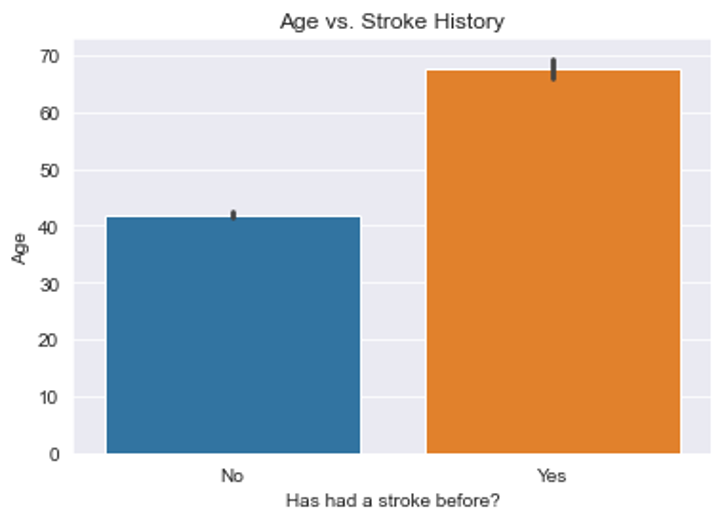
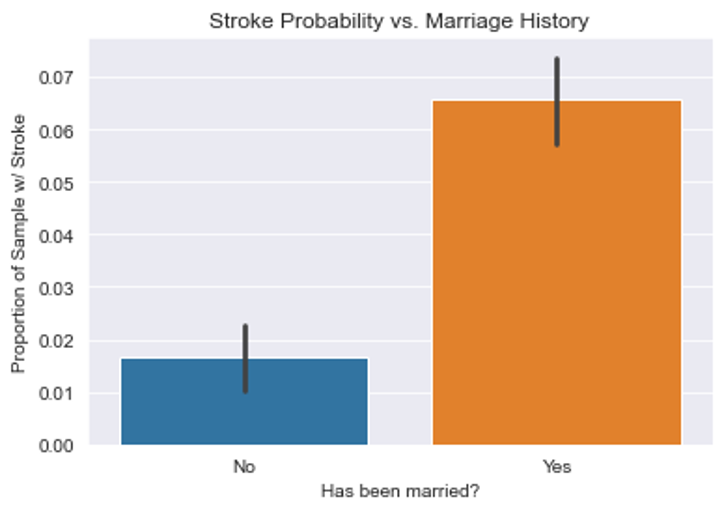

# Stroke-Predictions
Uses clinical patient information to predict strokes

# Data
Data is from: https://www.kaggle.com/datasets/fedesoriano/stroke-prediction-dataset
- 10 clinical features
  - Gender, Age, Hypertension, Heart Disease, Marriage Status, Work Type, Residence Type, Average Glucose Level, BMI, Smoking Status
- 1 binary target variable
  - Stroke
- 5110 observations
- Class Imbalance: 7% of samples are positive for having had a stroke

# Exploratory Analyses

Those who have had a stroke are ~26 years older than those who have not, on average.
 
 
 

Those who have been married are ~4x more likely to have had a stroke than those who have not been married, on average.

# Final Model
XGBClassifier with eta = 0.3, lambda = 1, max_depth = 5, and min_child_weight = 2

# Model Evaluation
The final model was chosen to maximize recall, since false negatives are worse than false positives when predicting stroke. False negatives may lead to a lack of proper treatment for those who might be at risk for stroke, while false positives only lead to an unnecessary checkup.

The final model showed a recall of 0.07 and an accuracy of 0.94. The model also showed a precision of 0.40 and an f1-score of 0.13.

# Recommendations
Further research and model development is required to obtain a suitable model for production use. The final model's recall of 0.07 is still low for stroke predictions, and may lead to dangerous false negative errors. The model has not learnt to predict the positive class well because of the low proportion of positive samples (7%) present in the dataset. A future project could explore using resampling techniques, such as oversampling with SMOTE, to reduce class imbalances in the target and increase recall.

# Contact
For further information, contact ankitkdey@gmail.com
